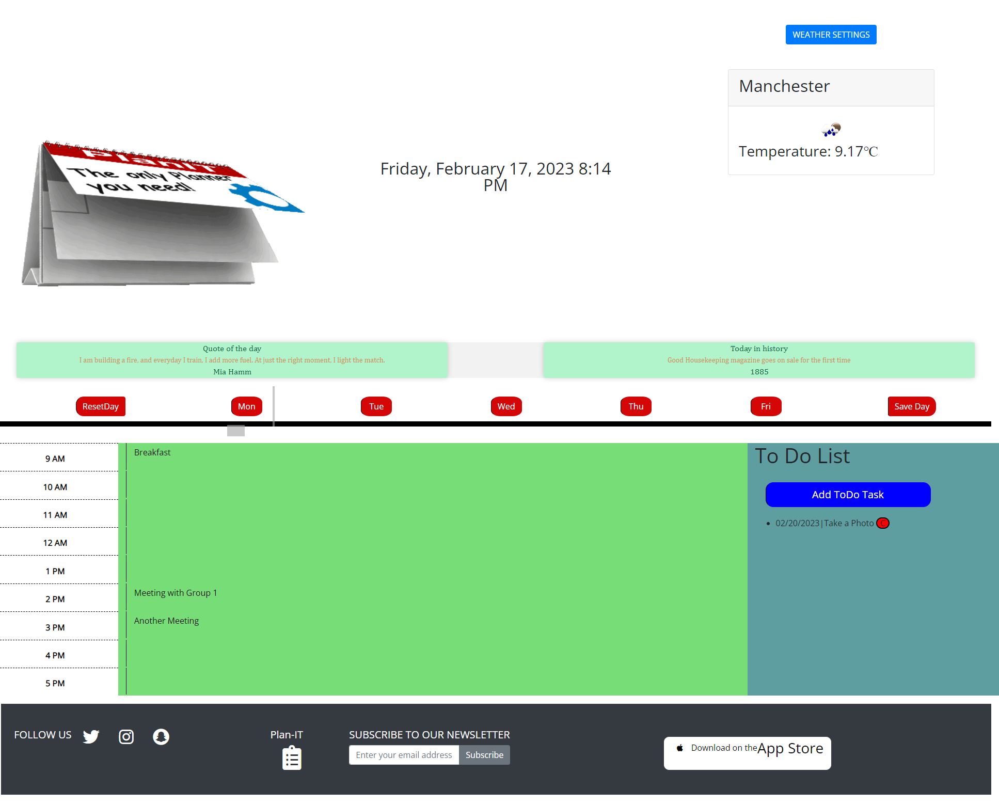

# Plan IT
[live website click here](https://fadumasaidcodes.github.io/Project-1-Plan-IT/).

PlanIT is a user-friendly web application designed to help you manage your busy schedule efficiently. It offers five day planner, weather forecasts, historical events, quotes of the day, and a to-do list, all in one place.

## User Stories
```As a user with a busy schedule, you can use PlanIT to:

Add important events to a five day planner to manage your time effectively.
View weather forecasts and switch between Celsius and Fahrenheit.
Learn about historical events that occurred on the same day.
Get inspired with a quote of the day.
Create a to-do list to plan your day.
```

# Tech Stack

Plan IT is built using the following technologies:

* JavaScript
* HTML
* CSS
* Bootstrap
* Quote API
* Numbers API
* Weather API
* Local storage
* DOM Manipulation
* Moment.js
* Video animation

## Usage
You can access PlanIT on any modern web browser. Once you open the app, you will see the current date and a quote of the day. You can navigate between each day, and add your tasks for the week. You can also view the weather for your area and historical events that occurred on the same day. Your to-do list will be saved to local storage, so you can access it even if you close and reopen the app.

## Contributors
Plan IT was developed by the following team members:

* Faduma
* Ebhetoa
* Arshad 
* Stuart

## Acknowledgments
We would like to thank the following resources for their contribution to the development of PlanIT:

* Quote API by forismatic.com
* Numbers API by numbersapi.com
* Weather API by OpenWeatherMap
* Moment.js library by momentjs.com

## Presentation

We have attached a PDF of our presentation here:


## Screenshots

Please find below a screenshot of the completed project:



## Copyright
© 2023 PlanIT. All rights reserved.
